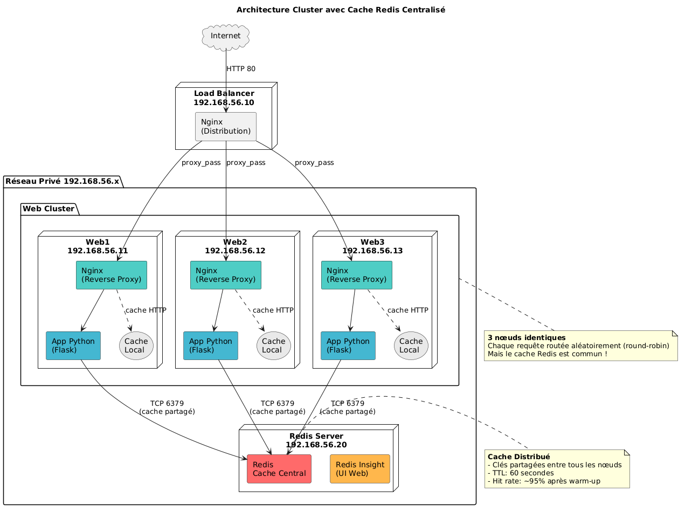
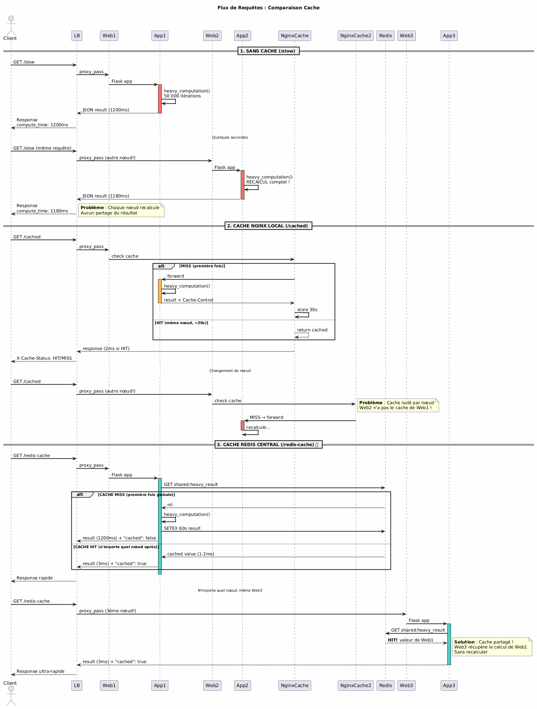
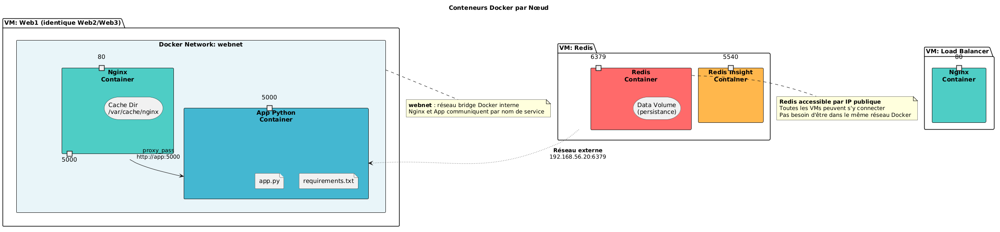
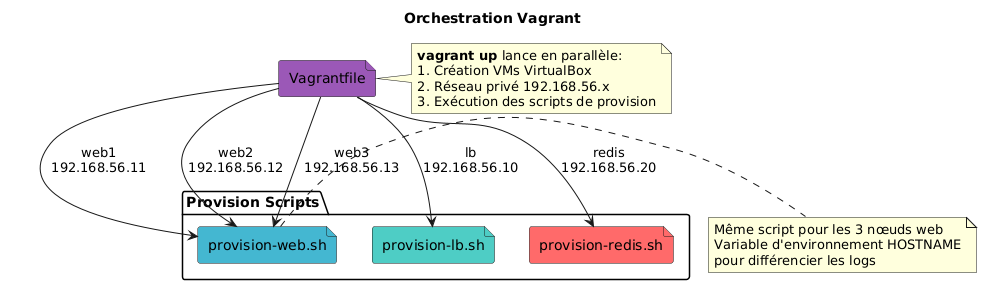

# LB‑Lab – Mini‑Cluster Docker + Redis Cache  
> ⚠️ Ce repo est un **lab d’apprentissage**.  
> Il n’est pas destiné à être déployé en production sans ajustements de sécurité et de performance.

---

## Table des matières  

| # | Section | Description |
|---|---------|-------------|
| 1 | 🚀 Installation & démarrage | Comment lancer le cluster avec Vagrant |
| 2 | 🧩 Architecture | Vue d’ensemble (diagramme) |
| 3 | 🔄 Flux de requêtes | Séquence illustrant les différents types de cache |
| 4 | 🐳 Docker components | Diagramme détaillé des conteneurs par VM |
| 5 | 🌐 Déploiement Vagrant | Processus d’orchestration par Vagrant |
| 6 | 📊 Benchmark rapide (optionnel) | Outils & commandes pour mesurer les temps de réponse |
| 7 | 📚 Concepts clés du cachingczy   |

---

## 1. 🚀 Installation & démarrage

```bash
# Cloner le repo
git clone https://github.com/<votre‑repo>/lb-lab.git
cd lb-lab

# Vérifier que VirtualBox + Vagrant sont installés
vagrant version   # >=2.x
virtualbox --help

# Démarrer toutes les VM (5 machines au total)
vagrant up

# Attendre ~10–15 min : chaque script provisionne Docker, crée un réseau privé et lance les conteneurs.
```

### Accès aux machines  

```bash
# Load Balancer (Nginx)
vagrant ssh lb

# Redis Server
vagrant ssh redis

# Web nodes (exemple web1)
vagrant ssh web1   # idem pour web2/web3
```

### Vérification rapide  

* **LB** → http://192.168.56.10/bench → `{"status":"ok","node":"webX"}`  
* **Redis UI** → http://192.168.56.20:5540  
* **Web node** → http://192.168.56.{11-13}/redis-stats → JSON contenant `key_hits`, `key_misses`, etc.

---

## 2. 🧩 Architecture  



> Le diagramme montre :  
> * Un load balancer Nginx distribuant sur trois nœuds Web (`web1/2/3`).  
> * Chaque nœud possède son propre Nginx local + cache HTTP (`my_cache`).  
> * Toutes les applications se connectent à un serveur Redis centralMinisé (`192.168.56.20`).  

---

## 3. 🔄 Flux de requêtes – Comparaison cache vs sans cache  



Ce diagramme séquentiel illustre :

1️⃣ Requête `/slow` – recalcul complet à chaque appel (*sans cache*).  
2️⃣ Requête `/cached` –ragachement localecoin Nginx (*cache local*).  
3️⃣ Requête `/redis-cache` – partage global via Redis (*cache centralisé*).

---

## 4. 🐳 Docker components – Conteneurs par VM  



Chaque machine virtuelle plaît :

- **Load Balancer** : un seul conteneur Nginx exposant le port `80`.  
- **Redis Server** : deux conteneurs (`redis`, `redisinsight`) partagent la même couche réseau externe (`redisnet`).  
- **Web nodes** : une pile docker compose composée d’un conteneur Nginx, d’un conteneur App Python et du volume de cache HTTP.

---

## 5️⃣ Déploiement Vagrant – Orchestration  



Le fichier `Vagrantfile` crée cinq VM :

```
lb          -> Load Balancer (192.xxx.xx.xx)
redis       -> Cache Redis Central (192.xxx.xx.yy)
web{1..3}   -> Trois nœuds Web identiques (192.xxx.xx.zz)
```

Chaque VM exécute son propre script de provision :

* `provision-lb.sh`      → Installe Nginx + scripts demo / benchmark.
* `provision-redis.sh`   → Lance Redis + Redis Insight.
* `provision-web.sh`     → Crée la pile Docker Compose sur chaque nœud.

Les réseaux privés permettent l’accès interne entre tous les services sans exposition publique.

---

## 📊 Benchmark rapide

Sur le LB vous pouvez lancer :

```bash
# Démarrer la démonstration interactive :
./demo-cache          # Explication visuelle du comportement du cache

# Benchmark comparatif :
./benchmark-all       # Utilise ApacheBench pour mesurer Requests/s 
```

Vous verrez directement que :

```
SANS CACHE            ~1200 ms / requête
CACHE LOCAL           ~1200 ms MISS / ~2 ms HIT 
CACHE REDIS CENTRAL   ~1200 ms MISS / ~2 ms HIT partout !
```

Ces chiffres sont approximatifs ; ils varient légèrement selon votre machine locale mais montrent clairement l’impact du caching partagé.

--- 

## 📚 Concepts clés du caching  

- **Cache local vs partagé** : Le cache HTTP stocke une réponse complète côté serveur; il ne se partage pas entre plusieurs instances sauf s’il est configuré en cluster ou via un backend partagé comme Redis ou Memcached.
- **TTL (Time‑to‑Live)** : Durée pendant laquelle une entrée reste valide dans le cache avant d’être invalidée ou rafraîchie.
- **Eviction policy** : Stratégie utilisée quand le pool mémoire est plein (`allkeys-lru`, etc.).
- **Cache hit/miss ratio** : Indicateur clé; plus c’est proche de 100 % = meilleure performance globale.

--- 

### À retenir  

1️⃣ Le load balancer distribue simplement ; il ne fait pas lui‑même du caching lourd autre que l’option “proxy_cache”.   
2️⃣ Le vrai gain vient du *cache partagé*, ici via Redis, qui évite aux nœuds Web multiples de recomputations coûteuses et garantit cohérence des données temporaires entre toutes les instances.

Bonne expérimentation ! 🎉
