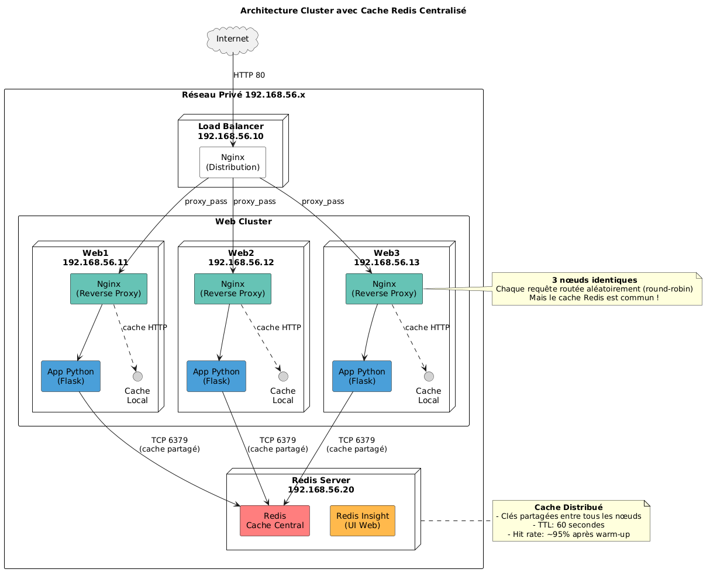

# LB-Lab – Mini-Cluster Docker + Redis Cache

> Ce repo est un **lab d'apprentissage**.
> Il n'est pas destiné à être déployé en production sans ajustements de sécurité et de performance.

---

## Table des matières

| # | Section | Description |
|---|---------|-------------|
| 1 | Architecture | Vue d'ensemble (diagramme) |
| 2 | Déploiement Vagrant | Processus d'orchestration par Vagrant |
| 3 | Installation & démarrage | Comment lancer le cluster avec Vagrant |
| 4 | Docker components | Diagramme détaillé des conteneurs par VM |
| 5 | Concepts clés du caching | TTL, éviction, hit/miss, cache local vs partagé |
| 6 | Nginx caching en détail | `proxy_cache_path`, `proxy_cache`, et directives associées |
| 7 | Benchmark | Outils & commandes pour mesurer les temps de réponse |

> Le contenu ci-dessous suit l'ordre logique de construction du lab : d'abord comprendre l'architecture, puis comment Vagrant l'orchestre, puis comment la démarrer, puis le détail des composants et des concepts de caching, et enfin comment mesurer les résultats.

---

## 1. Architecture



Le diagramme montre :

- Un load balancer Nginx distribuant sur trois nœuds Web (`web1`, `web2` et `web3`).
- Chaque nœud possède son propre Nginx local avec cache HTTP (`my_cache`).
- Toutes les applications se connectent à un serveur Redis central (`192.168.56.20`).

---

## 2. Déploiement Vagrant – Orchestration


Le fichier `Vagrantfile` crée cinq VM :

```
lb          -> Load Balancer      (192.168.56.10)
redis       -> Cache Redis Central (192.168.56.20)
web{1..3}   -> Trois nœuds Web identiques (192.168.56.11-13)
```

Chaque VM exécute son propre script de provision :

- `provision/provision-lb.sh` → Installe Docker + lance le conteneur Nginx (load balancing).
- `provision/provision-redis.sh` → Installe Docker + lance Redis et Redis Insight.
- `provision/provision-web.sh` → Installe Docker + lance la pile de conteneurs (Nginx + App Python) sur chaque nœud.

Les réseaux privés permettent l'accès interne entre tous les services sans exposition publique.

---

## 3. Installation & démarrage

```bash
# Cloner le repo
git clone https://github.com/<votre-repo>/lb-lab.git
cd lb-lab

# Vérifier que VirtualBox + Vagrant sont installés
vagrant version   # >= 2.x
virtualbox --help

# Démarrer toutes les VM (5 machines au total)
vagrant up

# Attendre ~10-15 min : chaque script provisionne Docker, crée un réseau privé et lance les conteneurs.
```

### Accès aux machines

```bash
# Load Balancer (Nginx)
vagrant ssh lb

# Redis Server
vagrant ssh redis

# Web nodes (exemple web1)
vagrant ssh web1   # idem pour web2 / web3
```

### Vérification rapide

- **LB** → `http://192.168.56.10/none` → réponse JSON `{"source": "db", "data": "...", "node": "webX"}`
- **Redis Insight** → `http://192.168.56.20:5540`
- **Web node** → `http://192.168.56.{11-13}/redis-only` → JSON indiquant `"source": "redis-cache"` après le premier appel

---

## 4. Docker components – Conteneurs par VM


Répartition des conteneurs par machine :

- **Load Balancer** : un seul conteneur Nginx exposant le port `80`.
- **Redis Server** : deux conteneurs (`redis-cache`, `redis-insight`) partagent le même réseau Docker (`redis-net`).
- **Web nodes** : deux conteneurs par nœud — un conteneur Nginx (reverse proxy + cache HTTP) et un conteneur App Python (Flask) — partageant le même réseau Docker (`web-net`), avec le volume de cache HTTP monté dans le conteneur Nginx.

---

## 5. Concepts clés du caching

- **Cache local vs partagé** : le cache HTTP stocke une réponse complète côté serveur ; il ne se partage pas entre plusieurs instances sauf s'il est configuré en cluster ou via un backend partagé comme Redis ou Memcached.
- **TTL (Time-to-Live)** : durée pendant laquelle une entrée reste valide dans le cache avant d'être invalidée ou rafraîchie.
- **Eviction policy** : stratégie utilisée quand le pool mémoire est plein (`allkeys-lru`, etc.).
- **Cache hit/miss ratio** : indicateur clé ; plus c'est proche de 100 % = meilleure performance globale.

---

## 6. Nginx caching en détail

### `proxy_cache_path` — définir où et comment Nginx stocke le cache

Cette directive va dans le bloc `http {}` et configure une zone de cache globale, réutilisable par plusieurs blocs `location`.

```nginx
proxy_cache_path /var/cache/nginx levels=1:2 keys_zone=my_cache:10m max_size=100m inactive=60m use_temp_path=off;
```

| Paramètre | Rôle |
|---|---|
| `/var/cache/nginx` | Chemin sur le disque (à l'intérieur du conteneur Nginx) où les fichiers de cache sont physiquement stockés. |
| `levels=1:2` | Organise les fichiers cachés dans une arborescence de sous-dossiers à 2 niveaux (basée sur un hash de l'URL), pour éviter d'avoir des milliers de fichiers dans un seul dossier — une optimisation du système de fichiers, sans impact fonctionnel. |
| `keys_zone=my_cache:10m` | Crée une zone mémoire nommée `my_cache`, de 10 Mo, qui stocke les métadonnées du cache (quelles clés existent, où elles pointent sur disque, leur état). Ce nom est réutilisé dans `proxy_cache` pour dire "utilise cette zone-là". |
| `max_size=100m` | Taille maximale des données mises en cache sur disque avant que Nginx commence à supprimer les entrées les plus anciennes. |
| `inactive=60m` | Si une entrée en cache n'est pas consultée pendant 60 minutes, elle est supprimée — indépendamment de son propre TTL de fraîcheur. |
| `use_temp_path=off` | Écrit directement dans le dossier final du cache plutôt que dans un dossier temporaire séparé — plus performant, pratique standard recommandée. |

### `proxy_cache` et directives associées — activer le cache dans un `location`

Une fois la zone déclarée dans `http {}`, on l'active route par route :

```nginx
location /nginx-only {
    proxy_cache my_cache;
    proxy_cache_valid 200 60s;
    add_header X-Cache-Status $upstream_cache_status;
    proxy_pass http://flask_backend;
}
```

| Directive | Rôle |
|---|---|
| `proxy_cache my_cache` | Active le cache pour ce bloc `location`, en utilisant la zone `my_cache` définie plus haut. |
| `proxy_cache_valid 200 60s` | Ne cache que les réponses avec un code HTTP 200 (succès), et les garde "fraîches" pendant 60 secondes — cohérent avec le TTL de 60 s côté Redis, pour comparer des durées équivalentes. |
| `add_header X-Cache-Status $upstream_cache_status` | Ajoute un en-tête de réponse HTTP personnalisé qui indique si c'était un `HIT`, `MISS`, ou `EXPIRED` — utile pour observer en direct (avec `curl -i`) si Nginx a servi depuis son cache ou non. |

### À retenir

1. Le load balancer distribue simplement ; il ne fait pas lui-même de caching lourd, hormis l'option `proxy_cache` si elle y est activée.
2. Le vrai gain vient du *cache partagé* — ici via Redis — qui évite aux nœuds Web multiples des recalculs coûteux et garantit la cohérence des données temporaires entre toutes les instances.

---

## 7. Benchmark rapide

Aucun outil de benchmark externe (type ApacheBench) n'est installé dans ce lab. La mesure se fait simplement avec `curl`, en observant le temps de réponse et l'en-tête `X-Cache-Status` sur chacune des 4 routes exposées par un web node :

```bash
# Temps de réponse + en-têtes, route par route
curl -w "\ntime: %{time_total}s\n" -i http://192.168.56.11/none
curl -w "\ntime: %{time_total}s\n" -i http://192.168.56.11/nginx-only
curl -w "\ntime: %{time_total}s\n" -i http://192.168.56.11/redis-only
curl -w "\ntime: %{time_total}s\n" -i http://192.168.56.11/both

# Répéter chaque appel une seconde fois pour voir l'effet du cache
```

Comportement attendu :

```
/none         -> ~1 s à chaque appel, X-Cache-Status: MISS à chaque fois (aucun cache)
/nginx-only   -> ~1 s au 1er appel (MISS), quasi instantané ensuite (HIT) tant que < 60 s
/redis-only   -> ~1 s au 1er appel, quasi instantané ensuite (source: redis-cache), mais X-Cache-Status reste MISS
/both         -> ~1 s au 1er appel, quasi instantané ensuite, X-Cache-Status passe à HIT
```

Ces chiffres sont approximatifs (le `time.sleep(1)` de l'app Flask fixe le délai simulé) ; ils montrent surtout **quelle couche** (Nginx, Redis, ou aucune) est responsable de l'accélération observée sur chaque route.